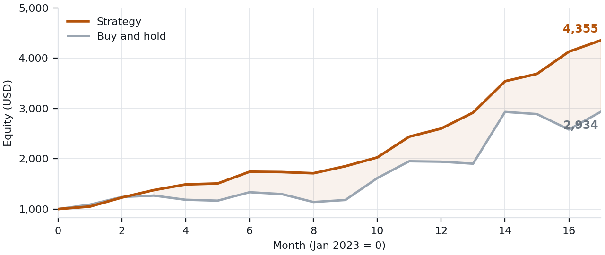
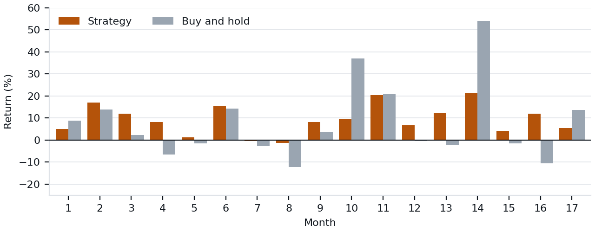

# crypto-lstm-predictor

Short-term cryptocurrency trend prediction with an LSTM and a **dynamic attention mechanism** whose weights are derived at inference time from market volatility and volume, rather than learned as fixed parameters.

Predicts a three-way trend label (up / down / neutral) from OHLCV data and technical indicators, and includes the backtest used to evaluate a trading strategy built on those signals.

---

## Results

Backtested on BTC/USDT, January 2023 to May 2024, starting from 1,000 USD.



| | Strategy | Buy and hold |
|---|---|---|
| Total return | **335.7%** | 197.0% |
| Final equity | 4,356.98 USD | 2,970 USD |
| Trades executed | 13,243 | 1 |
| Worst month | -1.36% | -12.20% |

**These are gross backtest numbers.** Transaction fees and slippage are not deducted. At 13,243 trades the accumulated cost is material, so treat the return as an upper bound, not a realised profit. The result that holds up better is the drawdown behaviour: in the market's worst month the strategy lost 1.36% against 12.20% for holding.



The strategy trims exposure into weakness, which costs it in sharp rallies. In the two strongest bull months, holding returned 36.94% and 54.14% against 9.43% and 21.38%.

### PCA ablation

| Configuration | Training time (s) | Test loss |
|---|---|---|
| PCA, 32 hidden dims | 4,172.34 | **1.1040** |
| No PCA, 64 hidden dims | 4,293.69 | 1.1144 |

Halving the hidden dimension after PCA cost nothing in accuracy, which suggests the raw indicator set carried redundancy rather than signal.

---

## How the attention layer works

Standard attention learns a fixed weighting over the input window. Here, volatility and volume are projected into the hidden space and multiplied into the LSTM output before the softmax, so the model's focus shifts with market conditions: broad in calm markets, concentrated on recent steps in volatile ones.

```python
class DynamicAttention(nn.Module):
    def __init__(self, hidden_dim):
        super().__init__()
        self.feature_layer = nn.Linear(2, hidden_dim, bias=False)
        self.attention     = nn.Linear(hidden_dim, 1, bias=False)

    def forward(self, lstm_out, volatility, volume):
        features = torch.cat((volatility.unsqueeze(-1),
                              volume.unsqueeze(-1)), dim=-1)
        dynamic_weights = torch.tanh(self.feature_layer(features))
        attention_weights = torch.softmax(
            self.attention(lstm_out * dynamic_weights).squeeze(-1), dim=1)
        context = torch.sum(attention_weights.unsqueeze(-1) * lstm_out, dim=1)
        return context, attention_weights
```

The context vector then passes through fully connected layers with LeakyReLU, dropout and batch normalisation, narrowing from `hidden_dim` to `hidden_dim/4` before the classification head.

Features are OHLCV plus SMA, EMA, RSI, stochastic oscillator, Bollinger Bands, MACD, ATR and Ichimoku Cloud, compressed with PCA before entering the sequence model.

---

## Quick start

```bash
git clone https://github.com/njaric03/crypto-lstm-predictor
cd crypto-lstm-predictor
pip install -r requirements.txt

# 1. download OHLCV data from Binance
python scripts/binance_scraper.py

# 2. point config/config.yaml at the resulting CSVs
#    (default: BTCUSDT, 3m candles, 2020-01 to 2024-01)

# 3. train and evaluate
python logic/models/lstm_dyn_attention_classification.py
```

Output goes to `results/`.

Baselines for comparison:

```bash
python logic/models/lstm_dyn_attention_regression.py   # attention + price regression
python logic/models/lin_regression.py                  # linear regression baseline
```

---

## Repository layout

```
config/
  config.yaml                              dataset paths and hyperparameters
logic/models/
  lstm_dyn_attention_classification.py     main model: dynamic attention, trend classification
  lstm_dyn_attention_regression.py         attention variant, price regression
  lin_regression.py                        linear regression baseline
scripts/
  binance_scraper.py                       OHLCV download from Binance
src/
  data_preprocessing/                      feature engineering, indicators, PCA, scaling
  utils/                                   shared helpers
results/                                   logs, metrics, saved runs
docs/                                      figures used in this README
```

---

## Full write-up

A technical report covering the architecture, the PCA ablation and the full backtest is available here: [LSTM_Dynamic_Attention_Trading.pdf](docs/LSTM_Dynamic_Attention_Trading.pdf)

## Limitations

- One asset, one market regime. Generalisation to other pairs or a different volatility environment is untested.
- No fee or slippage model in the backtest.
- The strategy is high turnover by design, which makes it particularly sensitive to the point above.

## License

MIT. See [LICENSE](LICENSE).
